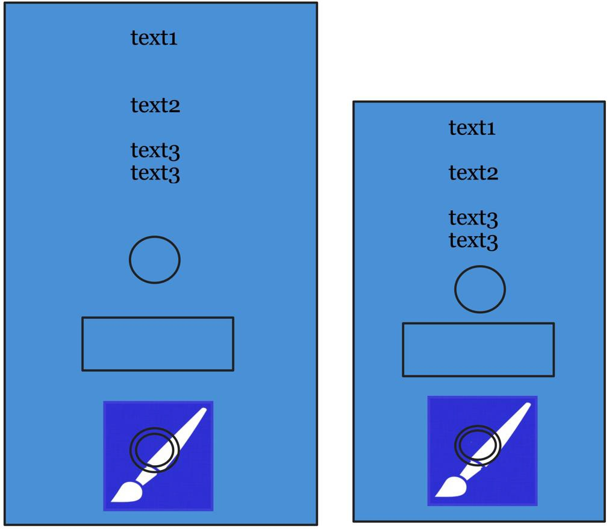
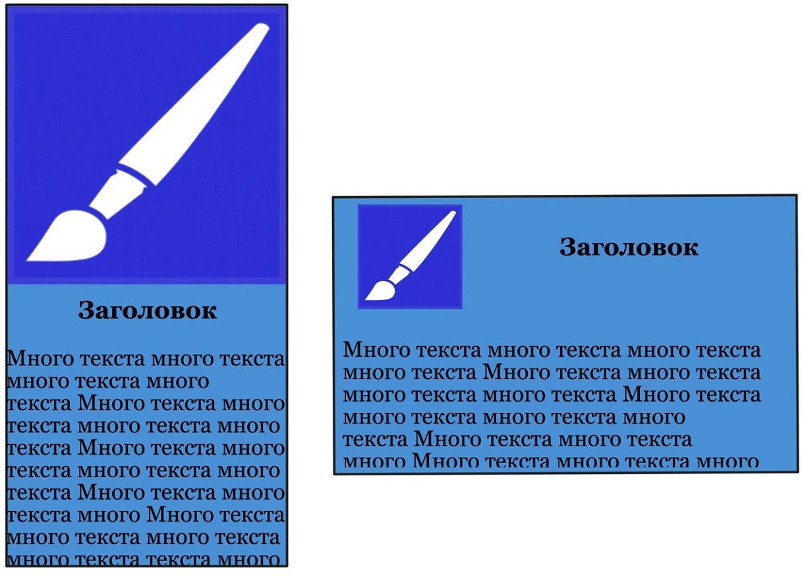
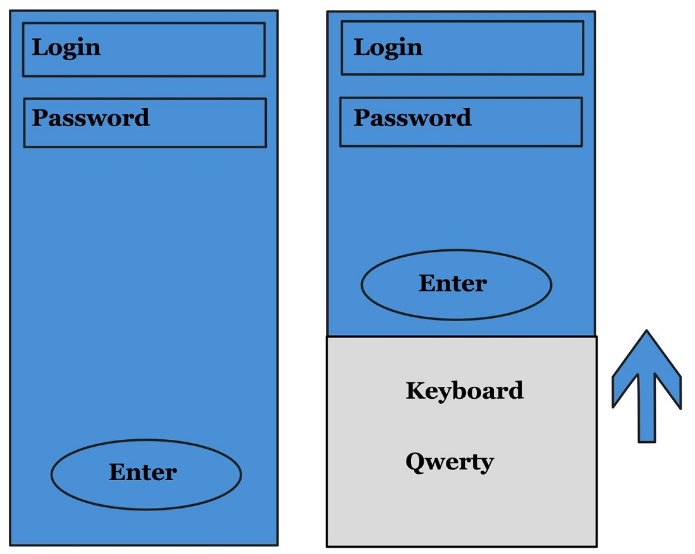
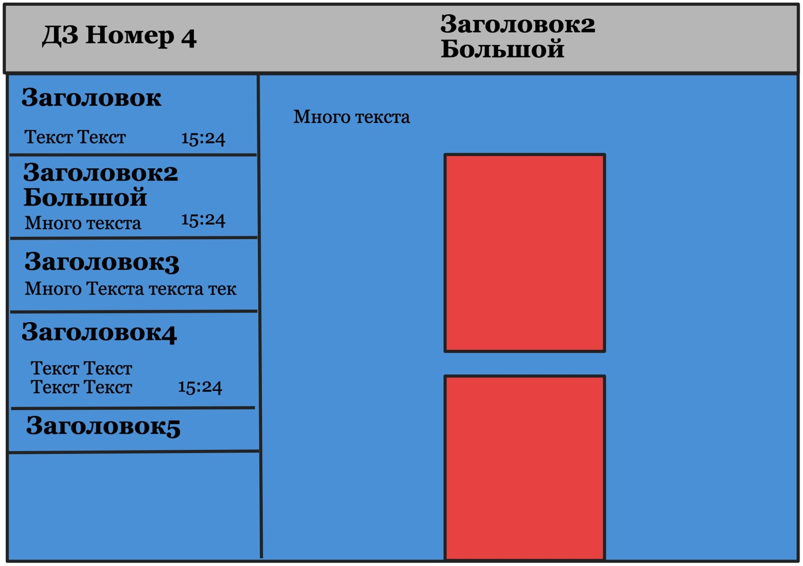

# Focus Start iOS 2020
### Ветки
* *master* &mdash; релизная версия проекта
* *develop* &mdash; актуальная версия проекта
* *feature/homework-<номер работы>* &mdash; ветка для подготовки домашнего задания под указанным номером  
&nbsp;  

<!---
ДОМАШНЯЯ РАБОТА №1 --------------------------------------------------------------------------------------------------
-->
## Домашняя работа №1
<details>
  <summary>
      Показать описание
  </summary>  

### Функционал приложения  
Приложение должно обладать интерфейсом взаимодействия с пользователем (меню с возможностью выбора нужного варианта).  
Основные функции:
1. Добавление нового автомобиля;
2. Вывод списка добавленных автомобилей;
3. Вывод списка автомобилей с использованием фильтра по типу кузова автомобиля.  

### Интерфейс приложения
Задача минимум &mdash; консольное приложение. При желании можно реализовать интерфейс используя **UIKit**.

### Информация об автомобиле
Для работы с данными автомобиля используется структура с названием **Car**.  
Данные об автомобиле:
| Название     | Тип       | Обязательное | Значение      |
| :-----------:| :--------:|:------------:|:-------------:|
| manufacturer | String    | Да           | Производитель |
| model        | String    | Да           | Модель        |
| body         | enum Body | Да           | Тип  кузова   |
| yearOfIssue  | Int       | Нет          | Год выпуска   |
| carNumber    | String    | Нет          | Гос номер     |

### Отображение информации об автомобиле
Отображение информации должно быть в формате:  
* <Поле>: <Значение>  

Для необязательных полей при отсутствии значения:  
* год выпуска &mdash; отображать «-»
* гос номер &mdash; пропускать это поле (оно не должно отображаться)  
&nbsp;  
&nbsp;    
</details>

<!---
ДОМАШНЯЯ РАБОТА №2 --------------------------------------------------------------------------------------------------
-->
## Домашняя работа №2
<details>
  <summary>
      Показать описание
  </summary>   

### Структура проекта  
Необходимо создать **Workspace** включающий в себя предыдущий проект и текущий.  
### Функционал приложения
Необходимо реализовать потокобезопасный массив, обеспечивающий корректное изменение/получение хранимых данных.  
Для демонстрации результата добавить в один **concurrent queue** две асинхронные задачи, в которых параллельно друг другу будет происходить добавление элементов в потокобезопасный массив.
После завершения работы вывести в консоль количество элементов.  
Добавление элементов в массивы производить в цикле:
```Swift
for number in 0…1000 { ... }
```  
### Требования к потокобезопасному массиву
1. Наименование &mdash; **ThreadSafeArray**;
2. Возможность работать с элементами любого типа;
3. Корректная обрабатка хранимых значений, независимо от того, в каком потоке происходит обращение.  

Обязательные методы:  
| №  | Наименование                 | Действие                                                           |
| :-:| -----------------------------|--------------------------------------------------------------------|
| 1  | append(_ element:)           | Добавляет новый элемент                                            |
| 2  | remove(at index: Int)        | Удаляет элемент с указанным индексом                               |
| 3  | subscript(index: Int) ->     | Возвращает элемент с указанным индеком                             |
| 4  | contains(_ element:) -> Bool | Метод проверки наличия элемента в коллекции. Возвращает true/false | 

Обязательные свойства:  
| №  | Наименование                 | Значение                                   |
| :-:| -----------------------------|--------------------------------------------|
| 1  | isEmpty: Bool                | Если массив пуст, то возвращает true       |
| 2  | count: Int                   | Возвращает количество добавленныхэлементов |
  
&nbsp;  
&nbsp;    
</details> 

<!---
ДОМАШНЯЯ РАБОТА №3 --------------------------------------------------------------------------------------------------
-->
## Домашняя работа №3  
<details>
  <summary>
      Показать описание
  </summary>    

### Структура проекта  
Добавить новый проект в существующий **Workspace**.
### Функционал приложения
Необходимо программно реализовать 3 экрана, каждый экран является отдельным **UIViewController** в **UITabBarController**'e. Каждый **UIViewController** &mdash; отдельный файл с классом. Лучшим вариантов является перенос всего представления в **UIView** + **UIViewController**.  
Основной упор делается на код и **Constraints**.  
### Первый экран
Необходимо добавить вверху 3 лэйбла. Первый стандартный, с небольшим текстом, второй лэйбл большего размера и с другим шрифтом, третий лэйбл также большего размера и с другим шрифтом, но теперь в две строки всегда, при любом размере экрана.  
Далее идут две кнопки, которые должны быть по-разному закруглены. Первая кнопка всегда должна быть круглой, вторая кнопка с закруглением 8.  
Далее любая картинка, по центру которой должен крутится черный **UIActivityIndicatorView**.  
Интерфейс должен быть полностью виден на размерах от <ins>4-х дюймов</ins>. Все элементы должны быть по центру, также расстояние между элементами должно увеличиваться. 1-й лэйбл всегда должен быть с расстоянием *8pt* до верха. Изображение всегад должно быть с расстоянием *8pt* до начала **UITabBarController**'a.  
<p align="center">  </p>  

### Второй экран
Реализовать разный дизайн в *портретном* и *горизонтальном* режиме. Все элементы находятся в **UIScrollView**, необходимо добавить так много текста, чтобы можно было скроллить экран вверх и вниз.  
В *портретном* изображение растягивается на всю ширину экрана и под ним находится заголовок, далее идёт текст. В *горизонтальном* режиме изображение находится в левом верхнем углу и имеет отступы со всех сторон. Заголовок теперь идет по центру изображения, весь текст располагается под этими двумя элементами.  
Определять перевернули ли устройство &mdash; по **Size Class**'aм.  
<p align="center">  </p>  

### Третий экран
Третий экран является псевдоэкраном логина. Поля Login и Password являются **UITextField**'ами, при вводе текста надпись Login и Password должны скрываться (быть плейсхолдерами). Вводимые данные в поле Password должны быть сокрыты с помощью символа **\***.  
Кнопка Enter должна уметь подниматься над *клавиатурой*, когда она показывается. Поднятие кнопки должно происходит через изменения её нижнего **Constraint**'a, желательно делать это с анимацией.  
Также должна быть возможность *тапнуть* в пустом месте экрана и тогда клавиатура должна скрыться, а кнопка Enter должна вернуться в исходное положение.  
<p align="center">  </p>  

&nbsp;  
&nbsp;    
</details>

<!---
ДОМАШНЯЯ РАБОТА №4 --------------------------------------------------------------------------------------------------
-->
## Домашняя работа №4  
<details>
  <summary>
      Показать описание
  </summary>    

### Структура проекта  
Добавить новый проект в существующий **Workspace**.
### Функционал приложения
Необходимо реализовать **UISplitViewController**, который выглядит по-разному на iPhone (4.0, 4.7, 5.8 дюйма) и на большом iPhone, iPad. При запуске приложения на айфоне должна появиться таблица, при запуске на большой айфоне, айпаде должна открыться таблица с выбранной первой ячейкой. Следовательно, в detail меню справа этот контент уже будет показываться.  
В таблице должен быть большой, жирный *заголовок*, ниже него какой-то *текст* и справа от текста *время*. Нужно учитывать, что *заголовок* может быть в 2 строки, *текст* в ячейке может быть в 2 строки, *время* всегда в одну строку. Также bottom констрэинт *времени* совпадает с bottom констрэинтом *текста*, то есть они всегда в низу идут под одну линию, даже если текст в две строки, а время в одну (пример: Ячейка 4).  
Текст, время и заголовкок могут быть любые. Главное, чтобы:
* Ячейка 1 &mdash; заголовок и текст в одну строку, время показывается;
* Ячейка 2 &mdash; заголовок в 2 строки, текст и время как в 1-й ячейке;
* Ячейка 3 &mdash; заголовок в 1 строку, времени нет, а текст удлиняется до правого края;
* Ячейка 4 &mdash; заголовок в 1 строку, текст в 2 строки, время показывается;
* Ячейка 5 &mdash; показывается только заголовок.

Когда тапаем на ячейку, появляется детальное представление, где в заголовке **UINavigationBar**'a дублируется заголовок ячейки. Также появляется текст, который может быть в несколько строк и может растянуться до правого края.  
Ниже текста располагаются 2 картинки, которые должны быть сделаны с закругленными углами и тенью одновременно! В каждой ячейке разные 2 картинки. Если картинки и текст не влезают полностью в экран, то должна быть возможность скроллить его!  
Ниже представлен примерный интерфейс:
<p align="center">  </p>  
</details>
